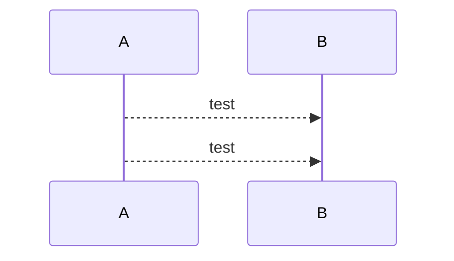
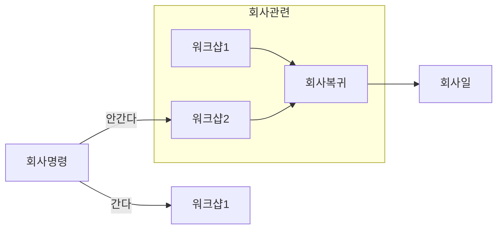
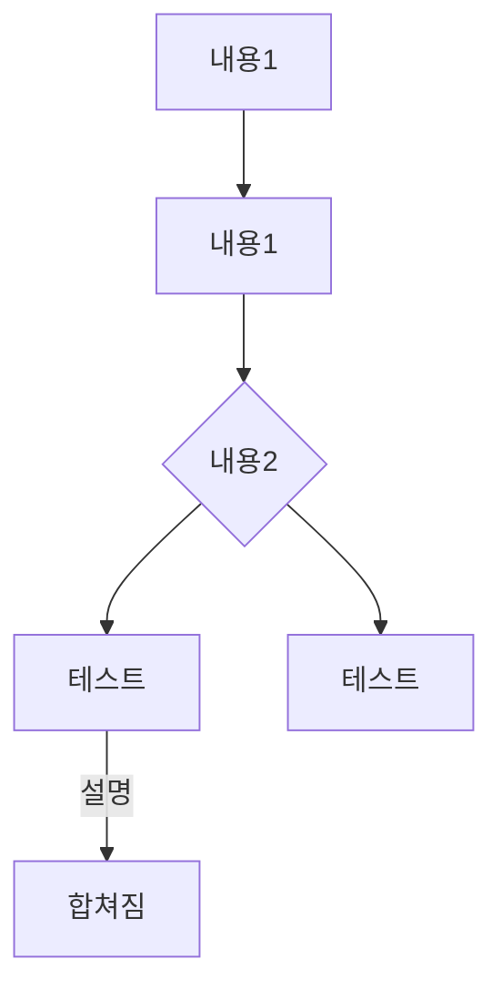

## 개발1
    test
    abc
    ccc

# 개발2
```bash
npm run start
npm run make
```
# 코드 
```code
  packagerConfig: {
    asar: true,
  },
  rebuildConfig: {},
  makers: [
    {
      name: '@electron-forge/maker-squirrel',
      config: {},
    },
    {
      name: '@electron-forge/maker-zip',
      platforms: ['darwin'],
    },
    {
      name: '@electron-forge/maker-deb',
      config: {},
    },
    {

```


## 머메이드
```mermaid
sequenceDiagram
    participant 제어기
    participant 외장Flash
    participant 인디고_RAM
    participant 인디고_내부_Flash
    participant 인디고IC
    
    제어기 ->> 제어기 : 펌웨어 업데이트 시작준비
	  Note right of 인디고IC: EX_FLASH_EN HIGH 시 WP 해제 #노트 쓰기
    제어기 ->> 인디고IC : EX_Flash_En HIGH 출력
    activate 인디고IC #라이프사이클 시작
    인디고IC -->> 외장Flash : Writing Protection 해제
    deactivate 인디고IC #라이프사이클 종료
    제어기 ->> 외장Flash : 펌웨어 데이터 WRITE (데이터 + CRC)
    activate 제어기 
    제어기 ->> 인디고_내부_Flash : 펌웨어 버전 Write, FW_UPDATE_FLAG 변경(신규 FW 있음)
    제어기 ->> 인디고IC : EX_Flash_En LOW 출력
    deactivate 제어기
    인디고IC -->> 외장Flash : Writing Protection
    activate 인디고IC    
    인디고IC ->> 인디고_내부_Flash : FW 업데이트 버전 및 FW_UPDATE_FLAG 상태 확인
    인디고_내부_Flash -->> 인디고IC : FW 업데이트 버전 및 FW_UPDATE_FLAG 상태 확인
		deactivate 인디고IC
		Rect rgb(254,254,254) # 박스 색 시작
	    alt 신규_FW 있음 && 펌웨어 버전이 다름 #if 
	    		Note right of 인디고IC: **신규펌웨어 업로드시 동작합니다
		      인디고IC ->> 인디고_RAM : FW_Update_Process 진행중 변경
	        인디고IC ->> 외장Flash : 펌웨어 데이터 리드 요청
	        외장Flash -->> 인디고IC : 펌웨어 데이터 전송    
	        인디고IC ->> 인디고IC : 펌웨어업데이트 (내부로직)
	        인디고IC ->> 인디고_RAM : FW_Update_Process IDLE,완료 변경
		     인디고IC->> 인디고_내부_Flash : FW_UPDATE_FLAG 변경(신규 FW 없음)
		   
	    else 조건 미충족 (펌웨어 버전 동일 또는 신규_FW 없음) # else
			    Note right of 인디고IC: **신규펌웨어가 없습니다.
	        인디고IC -->> 인디고IC : 추가 작업 없음 
	    end
    end # 박스 색 
```

## 머메이드2 


## 머메이드3 


## 머메이드4

